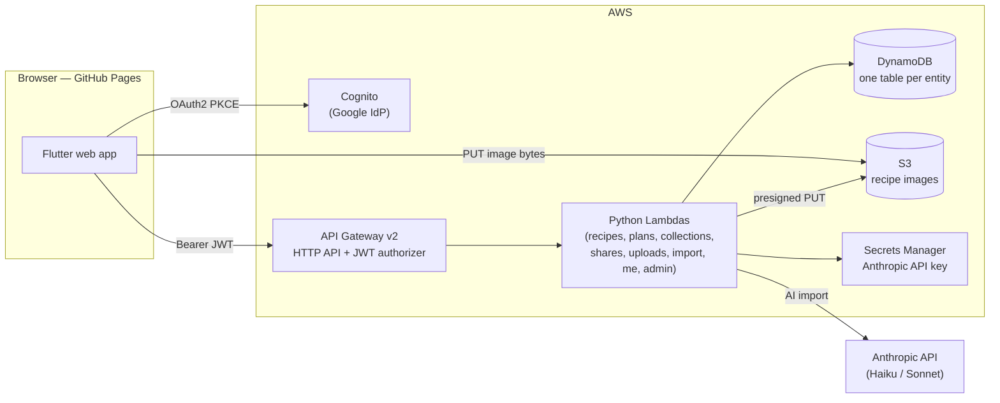

# Recipes

A recipe library, meal planner, and grocery-list app.

Live: <https://alexdalgleishmorel.github.io/recipes/>

Browse a personal cookbook with a Datadog-style query language, sketch a week
of meals on a day×meal calendar, get an automatically aggregated grocery list
from whichever meals you select, import recipes from a photo or PDF with AI,
organise recipes into collections, and fork-share recipes with other users.

The frontend is a Flutter app that targets web first (with mobile and desktop
support for free). The backend is a serverless AWS stack — API Gateway + Python
Lambdas + DynamoDB + Cognito — provisioned with Terraform. Both sides talk
through a repository abstraction, so the app runs either fully offline on a
local mock layer **or** against the live backend, selected at build time.

> Want the full picture? See [`docs/architecture.md`](docs/architecture.md) for
> system diagrams (frontend, backend, request flow, deploy pipeline).

## Repository layout

```
recipe/
├── frontend/              # Flutter app (web + mobile + desktop)
├── backend/               # Python 3.12 Lambda handlers + shared layers + tests
├── infra/                 # Terraform — bootstrap (OIDC + state) and the app stack
├── docs/                  # architecture, AWS OIDC setup, recipe-import schema
└── recipes-wireframe/     # design handoff bundle (HTML/CSS/JS prototype)
```

## Architecture at a glance



The frontend never imports an HTTP client or AWS SDK directly — every screen
talks to an abstract `XRepository`, and `main.dart` wires in either the
`Local*` (mock) or `Http*` (backend) implementation. See
[`docs/architecture.md`](docs/architecture.md) for the detailed diagrams.

## Frontend

A Flutter app organised by layer (`models/`, `screens/`, `services/`,
`widgets/`, `utils/`, `theme/`). No external state-management package — a
top-level `AppShell` `StatefulWidget` owns the loaded recipes + plans, and
mutations bubble up via callbacks that trigger a refetch.

### Tech stack

- **Flutter 3.41** (Material 3, web target enabled)
- **http** + **crypto** + **web** — backend calls and the OAuth2 PKCE flow
- **shared_preferences** — local persistence for the mock data layer + settings
- **google_fonts** — Inter Tight, Newsreader, JetBrains Mono
- **file_picker** — the upload dropzone
- **flutter_markdown** — AI chat replies
- **flutter_svg** — brand wordmark + icon

### Data layer — the swap point

Each entity has an abstract `XRepository` interface in
[`frontend/lib/services/repositories.dart`](frontend/lib/services/repositories.dart):
`RecipesRepository`, `MealPlansRepository`, `CollectionsRepository`,
`SharingRepository`, `UploadsRepository`, `RecipeImportService`,
`AuthRepository`, `AdminRepository`, `SettingsRepository`.

Two complete implementation sets exist:

- **`Local*`** — wrap `shared_preferences`, seed from the bundled JSON in
  [`frontend/assets/seed/`](frontend/assets/seed/) (24 recipes + 2 sample plans
  lifted verbatim from the wireframe). Fully offline; no AWS needed.
- **`Http*`** — call the live backend over HTTP, with the Cognito ID token
  attached as `Authorization: Bearer <jwt>`.

Which set loads is a compile-time switch in
[`main.dart`](frontend/lib/main.dart): `--dart-define=USE_BACKEND=true` selects
the backend stack, otherwise the app runs entirely on the local mocks (the
default for `flutter test` and local dev). A separate **read-only demo** set
(`buildDemoRepositories`) backs the portfolio demo account — writes throw
`DemoWriteBlockedException` after a toast.

### Screens

| Screen | Path |
|---|---|
| Login | [login_screen.dart](frontend/lib/screens/login_screen.dart) |
| Browse | [browse_screen.dart](frontend/lib/screens/browse_screen.dart) |
| Recipe detail (read + edit) | [recipe_detail_screen.dart](frontend/lib/screens/recipe_detail_screen.dart) |
| Upload / AI import | [upload_screen.dart](frontend/lib/screens/upload_screen.dart) |
| Collections | [collections_screen.dart](frontend/lib/screens/collections_screen.dart) · [collection_detail_screen.dart](frontend/lib/screens/collection_detail_screen.dart) |
| Meal plans list | [plans_screen.dart](frontend/lib/screens/plans_screen.dart) |
| Plan detail (calendar + grocery) | [plan_detail_screen.dart](frontend/lib/screens/plan_detail_screen.dart) |
| Shared with me | [shared_with_me_screen.dart](frontend/lib/screens/shared_with_me_screen.dart) |
| Account settings | [account_settings_screen.dart](frontend/lib/screens/account_settings_screen.dart) |
| Admin users | [admin_users_screen.dart](frontend/lib/screens/admin_users_screen.dart) |

### Notable utilities

- [`utils/search_query.dart`](frontend/lib/utils/search_query.dart) — full
  Datadog-syntax parser (free text, `field:value`, quoted values, `(a OR b)`,
  AND/OR, negation, numeric comparisons, custom tags).
- [`utils/grocery_aggregator.dart`](frontend/lib/utils/grocery_aggregator.dart)
  — sums ingredients across selected recipes, dedupes by name+unit, and groups
  into Produce / Protein / Dairy / Pantry / Other.

## Backend

Python 3.12 Lambdas behind an API Gateway v2 HTTP API, persisting to DynamoDB.
One Lambda backs each entity and dispatches across its routes on HTTP method +
path. Code lives in [`backend/`](backend/); the HTTP API, Lambda, IAM, and
table wiring live in Terraform under [`infra/shared/`](infra/shared/).

```
backend/
├── functions/         # one dir per Lambda; each exposes handler(event, context)
│   ├── recipes/  plans/  collections/  shares/  uploads/
│   ├── import_recipe/ # AI photo/PDF -> structured Recipe draft
│   ├── me/  admin/    # profile + entitlements
│   └── hello/         # health-check / pattern proof
├── layers/
│   ├── common/        # api.py (request/response + @route), auth.py (caller identity)
│   └── data_access/   # DynamoDB accessors: get/list/put/delete + GSI lookups
├── tests/             # pytest (DynamoDB mocked with moto)
└── build.sh           # produces backend/dist (the dir Terraform zips)
```

### API surface

| Method + path | Auth | Handler |
|---|---|---|
| `GET /hello` | open | health check |
| `GET/POST /recipes`, `GET/PUT/DELETE /recipes/{id}` | JWT | recipes |
| `POST /recipes/import`, `GET /recipes/import/batch/{id}` | JWT | import_recipe |
| `GET/POST /plans`, `GET/PUT/DELETE /plans/{id}` | JWT | plans |
| `GET/POST /collections`, `GET/PUT/DELETE /collections/{id}` | JWT | collections |
| `POST /shares`, `GET /shares/incoming`, `POST /shares/{idOrToken}/claim` | JWT | shares |
| `GET /shares/{token}` (link preview) | open | shares |
| `POST /uploads/presign` | JWT | uploads |
| `GET/PUT /me` | JWT | me |
| `GET /admin/users`, `POST /admin/entitlements` | JWT | admin |

### Data model

Every entity table is **owner-partitioned**: partition key `userId`, sort key
`entityId`, so a user's whole library lives on one partition and a `Query` is
always scoped to that user. One table per entity (`recipe-recipes`,
`recipe-meal-plans`, `recipe-collections`, `recipe-users`, `recipe-shares`),
all `PAY_PER_REQUEST`. The model JSON is stored intact under a `doc` attribute.
Two GSIs support non-owner lookups: `email_index` on users (share-by-email) and
`token_index` / `recipient_email_index` on shares (redeem a link / list pending
shares). Sharing is **fork-copy** — a share materialises a copy of the entity
under the recipient's `userId`, so there is no cross-user read path.

### Auth

Cognito user pool federated to **Google** (the sole IdP — no passwords). The
frontend drives the Hosted UI with OAuth2 auth-code + PKCE, then sends the
Cognito **ID token** as `Authorization: Bearer <jwt>`. API Gateway's JWT
authorizer verifies it and exposes the claims at
`requestContext.authorizer.jwt.claims`, where `sub` is the stable user id.
Handlers resolve identity through the single seam `common.get_user_id`.

### AI recipe import

`POST /recipes/import` parses an uploaded photo, PDF, or JSON into a structured
`Recipe` draft, cheapest-tier-first to minimise cost per parsed recipe:

1. `.json` upload → validated against the canonical schema with `jsonschema`,
   **no AI call** ($0).
2. image / PDF → downsized (Pillow) or rendered (PyMuPDF) and sent to the
   Anthropic API — primary **Haiku**, falling back to **Sonnet** once if a
   completeness check fails (never Opus).

The Anthropic API key is read at runtime from AWS Secrets Manager. The draft
shape is the single source of truth in
[`docs/recipe-import-schema.md`](docs/recipe-import-schema.md).

## Infrastructure

Terraform, two roots:

- [`infra/bootstrap/`](infra/bootstrap/) — **one-time** setup: GitHub OIDC
  provider + IAM roles (keyless CI) and the S3/DynamoDB Terraform state backend.
  Run once with your own AWS admin credentials. See
  [`docs/aws-oidc.md`](docs/aws-oidc.md).
- [`infra/shared/`](infra/shared/) — the **app stack**: HTTP API, Lambdas, IAM,
  DynamoDB tables, Cognito user pool + Google IdP + JWT authorizer, the S3
  uploads bucket, and the Secrets Manager grant. Resources are split by concern
  (`recipes.tf`, `plans.tf`, `auth.tf`, …) and merged into the generic
  `local.handlers` / `local.routes` maps in `main.tf` — adding an entity is
  just a handler + a route map.

## CI / CD

Three GitHub Actions workflows ([`.github/workflows/`](.github/workflows/)):

- **`ci.yml`** — on every PR/push: `flutter analyze` + `flutter test`.
- **`deploy-pages.yml`** — on `frontend/**` changes to `main`: builds the web
  app with `--dart-define=USE_BACKEND=true` against the live Cognito + API
  config, then publishes to GitHub Pages (served at `/recipes/`).
- **`deploy-backend.yml`** — on `backend/**` or `infra/shared/**` changes to
  `main`: builds the Lambda bundle and `terraform apply`s `infra/shared` via
  keyless GitHub OIDC (no static AWS keys; Google OAuth secrets come from repo
  secrets as `TF_VAR`s).

## Local setup

### 1. Install Flutter

If you don't already have Flutter, follow
<https://docs.flutter.dev/get-started/install>, then verify:

```sh
flutter --version    # Flutter 3.41+, Dart 3.11+
flutter doctor
```

### 2. Run the frontend (local mock mode — no AWS needed)

```sh
cd frontend
flutter pub get
flutter run -d chrome
```

The app boots with the 24 seeded recipes and 2 seeded meal plans already in
local storage. To run against the live backend instead, add
`--dart-define=USE_BACKEND=true` (plus the Cognito `--dart-define`s; the API
URL already defaults to the deployed stack).

### 3. Run the frontend tests

```sh
cd frontend
flutter test          # search-query parser + grocery aggregator
flutter analyze       # must be clean before declaring done
```

### 4. Build for production

```sh
cd frontend
flutter build web --release --base-href=/recipes/
# output: frontend/build/web/
```

### 5. Run the backend tests

```sh
cd backend
python3 -m pip install -r tests/requirements-dev.txt   # boto3 + moto + pytest
python3 -m pytest tests
```

The data-access tests mock DynamoDB with `moto`, standing up tables that mirror
`infra/shared/tables.tf`.

### Wiping local seed data

Local mock data lives in `shared_preferences`. To reset:

- **Web (Chrome)**: DevTools → Application → Local Storage → clear the origin's
  entries, then reload.
- **Mobile / desktop**: uninstall/reinstall, or delete the app's
  `shared_preferences` store.

## Wireframe

The design originated from a Claude Design (claude.ai/design) handoff. The full
source HTML lives at
[`recipes-wireframe/project/Recipes.html`](recipes-wireframe/project/Recipes.html)
— the source of truth for any visual or behavioural question. The hardcoded
`RECIPES` / `PLANS` arrays in it are the source of the seed JSON.
