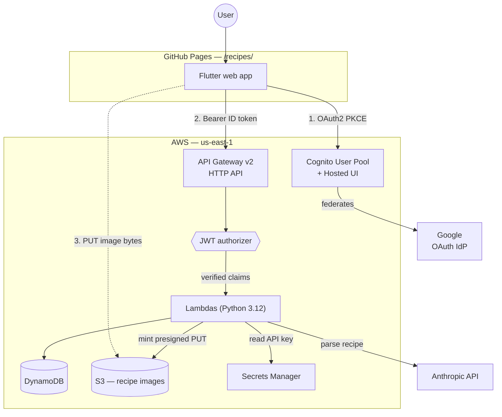
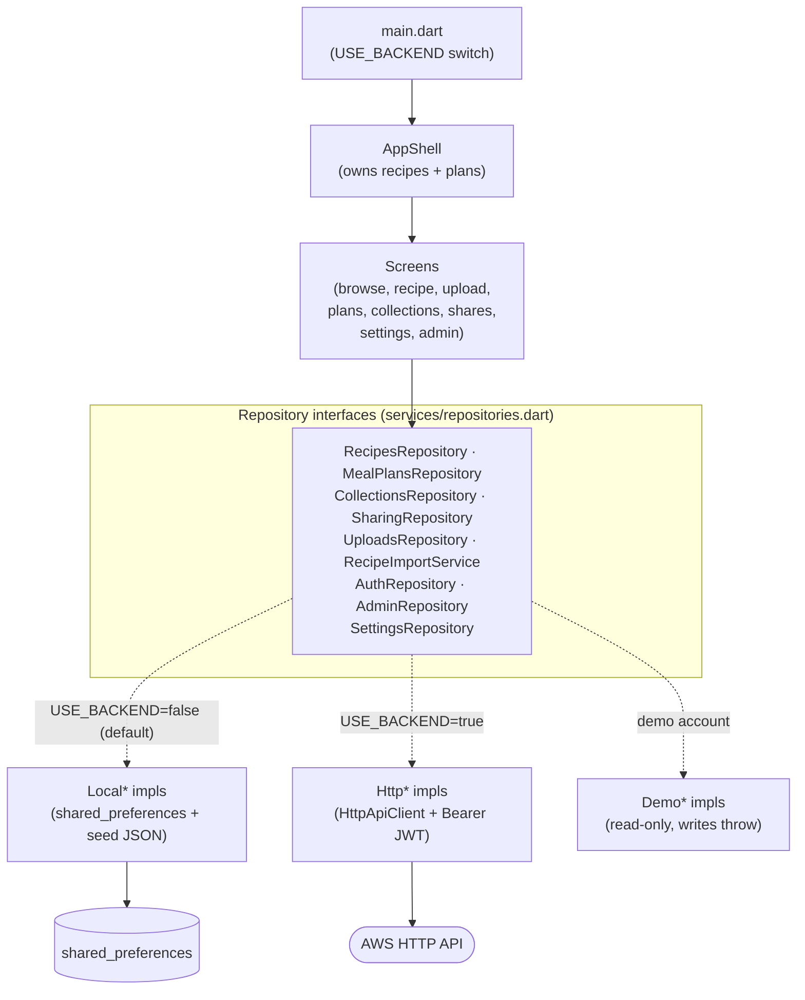
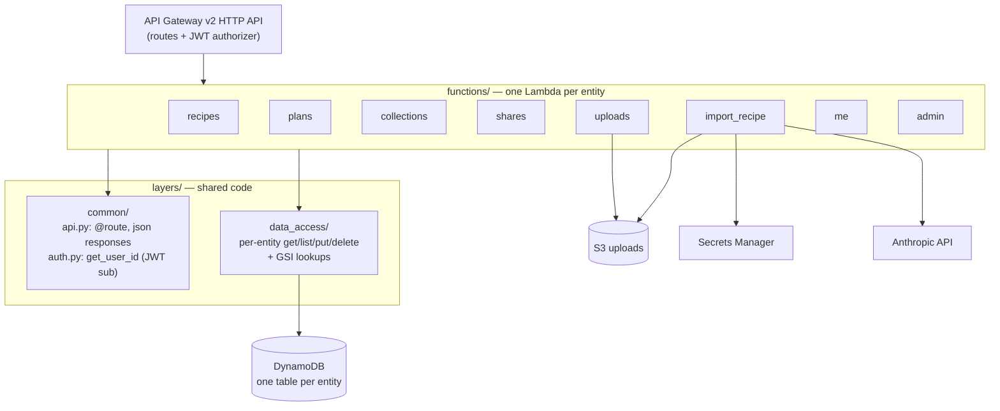
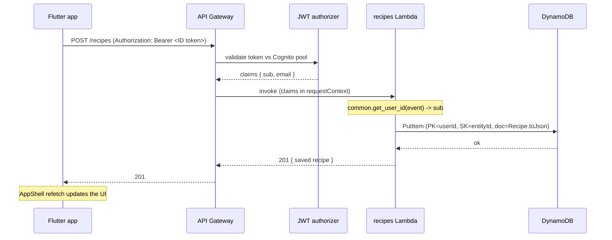
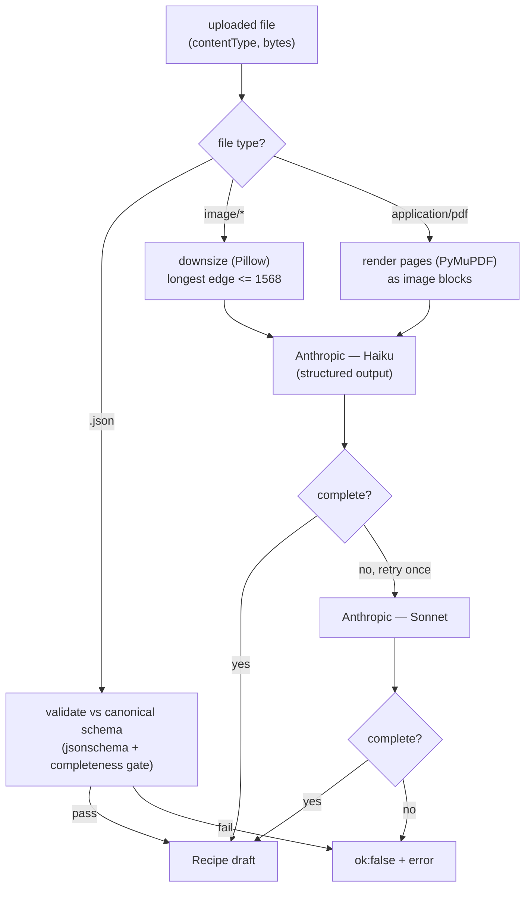
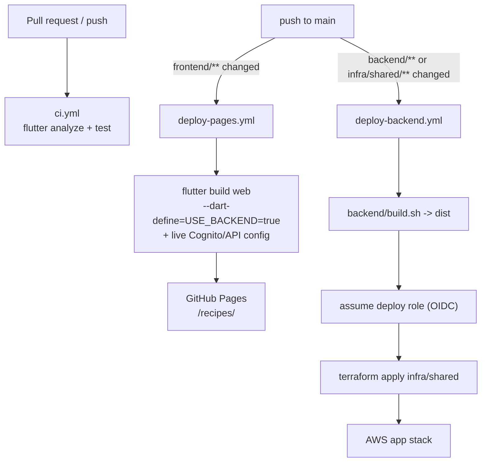

# Architecture

A high-level map of the Recipes app: a Flutter web frontend on GitHub Pages,
talking through a repository abstraction to a serverless AWS backend (API
Gateway + Python Lambdas + DynamoDB + Cognito), provisioned with Terraform.

The guiding idea is the **repository seam**: no screen knows whether its data
comes from a local mock or the live backend. The same abstract interfaces have
two implementation sets (`Local*` and `Http*`), chosen at build time. That seam
is why the app can run fully offline for development and demos, yet ship against
real AWS in production without any UI change.

- [System context](#system-context)
- [Frontend](#frontend)
- [Backend](#backend)
- [Data model](#data-model)
- [Request lifecycle](#request-lifecycle)
- [Auth flow](#auth-flow)
- [AI recipe import](#ai-recipe-import)
- [Deploy pipeline](#deploy-pipeline)

## System context



The frontend authenticates with Cognito (federated to Google), then calls the
HTTP API with the Cognito **ID token** as a bearer credential. Every app route
is verified by the JWT authorizer before reaching a Lambda. Image bytes bypass
the API: a Lambda mints a presigned URL and the browser PUTs directly to S3.

## Frontend

Layered Flutter app, no state-management package. A top-level `AppShell`
`StatefulWidget` owns loaded state; screens mutate via callbacks that trigger a
refetch. Every screen depends only on an abstract repository — never on `http`
or AWS directly.



`main.dart` builds one `AppRepositories` bundle and injects it down the tree.
The compile-time `USE_BACKEND` define picks `Local*` (offline, the default for
`flutter test` and local dev) or `Http*` (live backend). A third **read-only
demo** set backs the portfolio demo account — writes raise
`DemoWriteBlockedException` after a toast, swallowed at the `runZonedGuarded`
root so a blocked write quietly aborts.

## Backend

One Lambda per entity, each dispatching across its routes on method + path.
Shared concerns live in two layers imported by every handler.



- **`common/api.py`** — the `@route` decorator turns raised `ApiError` /
  `Unauthorized` into clean JSON responses; handlers stay on the happy path.
- **`common/auth.py`** — `get_user_id` is the single identity seam: it reads the
  verified JWT `sub` claim (with a dev `x-user-id` header fallback used only by
  tests). No handler reads identity directly.
- **`data_access/`** — per-entity accessors that `Query` the caller's partition;
  the model JSON round-trips intact under a `doc` attribute.

Packaging is generic: `build.sh` flattens handlers + layers + vendored deps into
`backend/dist`, Terraform zips it once, and every Lambda selects its entrypoint
via its `handler` string from `local.handlers` in `main.tf`.

## Data model

Every entity table is **owner-partitioned** — partition key `userId`, sort key
`entityId` — so a user's whole library is one cheap, consistent `Query` and
per-user isolation is the default.

```mermaid
erDiagram
  USERS ||--o{ RECIPES : owns
  USERS ||--o{ MEAL_PLANS : owns
  USERS ||--o{ COLLECTIONS : owns
  USERS ||--o{ SHARES : "sends"

  USERS {
    string userId PK
    string entityId SK
    string email "email_index GSI"
    bool   canAiImport
  }
  RECIPES {
    string userId PK
    string entityId SK
    json   doc
  }
  MEAL_PLANS {
    string userId PK
    string entityId SK
    json   doc
  }
  COLLECTIONS {
    string userId PK
    string entityId SK
    json   doc
  }
  SHARES {
    string userId PK "sharer"
    string entityId SK
    string token "token_index GSI"
    string recipientEmail "recipient_email_index GSI"
    json   doc "entity snapshot"
  }
```

- **One table per entity** (`recipe-recipes`, `recipe-meal-plans`,
  `recipe-collections`, `recipe-users`, `recipe-shares`), all
  `PAY_PER_REQUEST` — keeps the access layer and IAM grants legible (each table
  gets DynamoDB item ops on exactly its own ARN + `/index/*`).
- **GSIs** cover the only non-owner lookups: `email_index` (resolve a user by
  email to share-by-email), `token_index` (redeem a link share without knowing
  the owner), `recipient_email_index` (list shares pending for a recipient who
  has no row yet).
- **Sharing is fork-copy**: redeeming a share materialises a *copy* of the
  entity under the recipient's `userId`, so there is never a cross-user read
  path to model.

## Request lifecycle

A typical authenticated write (e.g. saving a recipe):



If the token is missing or invalid, API Gateway rejects the request before any
Lambda runs. Inside the handler, `ApiError` / `Unauthorized` are mapped to JSON
error responses by the `@route` decorator; any unexpected exception becomes a
500 (details go to CloudWatch, not the client).

## Auth flow

```mermaid
sequenceDiagram
  participant FE as Flutter app
  participant CG as Cognito Hosted UI
  participant G as Google
  participant GW as API Gateway

  FE->>CG: redirect to Hosted UI (auth code + PKCE challenge)
  CG->>G: federate sign-in
  G-->>CG: profile (email, name)
  CG-->>FE: redirect back with auth code
  FE->>CG: exchange code + PKCE verifier
  CG-->>FE: ID + access + refresh tokens
  Note over FE: store tokens; attach ID token to API calls
  FE->>GW: API request (Authorization: Bearer <ID token>)
  GW-->>FE: verified by JWT authorizer (aud = app client id)
```

Cognito federates to Google as the sole IdP (no passwords). The browser app
client is public (PKCE, no secret), authorization-code flow only. The frontend
sends the **ID token** (not the access token) because its `aud` equals the app
client id the authorizer is configured to accept.

## AI recipe import

`POST /recipes/import` turns an uploaded photo, PDF, or JSON file into a
structured `Recipe` draft, cheapest-tier-first to hold down cost per parsed
recipe behind a reliability floor.



- `.json` uploads cost **$0** — validated against the canonical schema with no
  AI call.
- Image/PDF uploads go to **Haiku** first, falling back **once** to **Sonnet**
  if a completeness check fails (never Opus). Incomplete drafts are never
  emitted — the file's result is `ok:false` instead.
- The Anthropic API key is read at runtime from Secrets Manager and cached.

The draft shape is the single source of truth in
[`recipe-import-schema.md`](recipe-import-schema.md), shared by the JSON
validator, the AI structured-output constraint, and the frontend editor.

## Deploy pipeline

Two independent deploy paths to `main`, plus CI on every PR. Backend deploys use
keyless GitHub OIDC — no static AWS keys.



- **`ci.yml`** — `flutter analyze` + `flutter test` on every PR/push.
- **`deploy-pages.yml`** — builds the web app against the live backend config
  (`USE_BACKEND=true`, Cognito + API URL from repo variables) and publishes to
  Pages at `/recipes/`.
- **`deploy-backend.yml`** — builds the Lambda bundle and `terraform apply`s
  `infra/shared` after assuming the deploy role via OIDC. Google OAuth secrets
  are passed as `TF_VAR`s from repo secrets. The OIDC provider, deploy role, and
  Terraform state backend are created once by `infra/bootstrap` — see
  [`aws-oidc.md`](aws-oidc.md).
